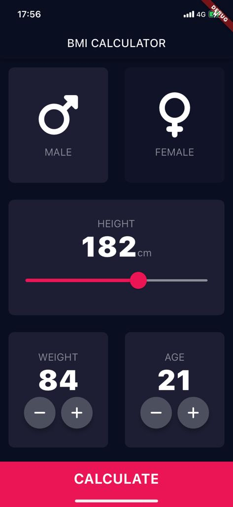
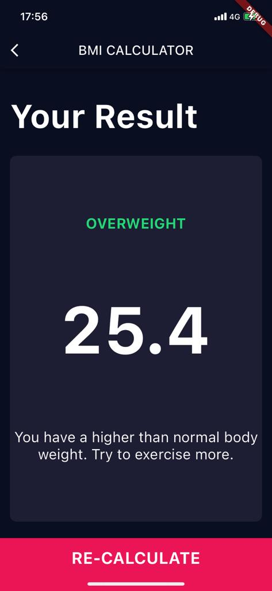

<h1>BMI Calculator App</h1>
<br>
<p>
  
  
</p>

## About the Project

This is a simple BMI (Body Mass Index) calculator app built with Flutter. It calculates the user's BMI based on their height and weight and displays the result.

## Technologies and Packages Used

- Flutter
- Dart

## Installation

```
git clone https://github.com/denaktepe/bmi-calculator/
cd BMI_Calculator
flutter pub get
flutter run
```

## How to Use

1. Open the app and enter your height and weight on the home screen.
2. Tap the "Calculate" button.
3. The result screen will display your calculated BMI value along with a comment.

## Contributions

If you would like to contribute to this project, please follow these steps:

1. Fork this repository to your GitHub account.
2. Create a new branch: `git checkout -b my-feature`
3. Make your changes and commit them: `git commit -m "A descriptive commit message"`
4. Push your changes: `git push origin my-feature`
5. Open a pull request and share your changes.

## Contact

For any questions, suggestions, or feedback, please email me at sametcagriaktepe@gmail.com.


